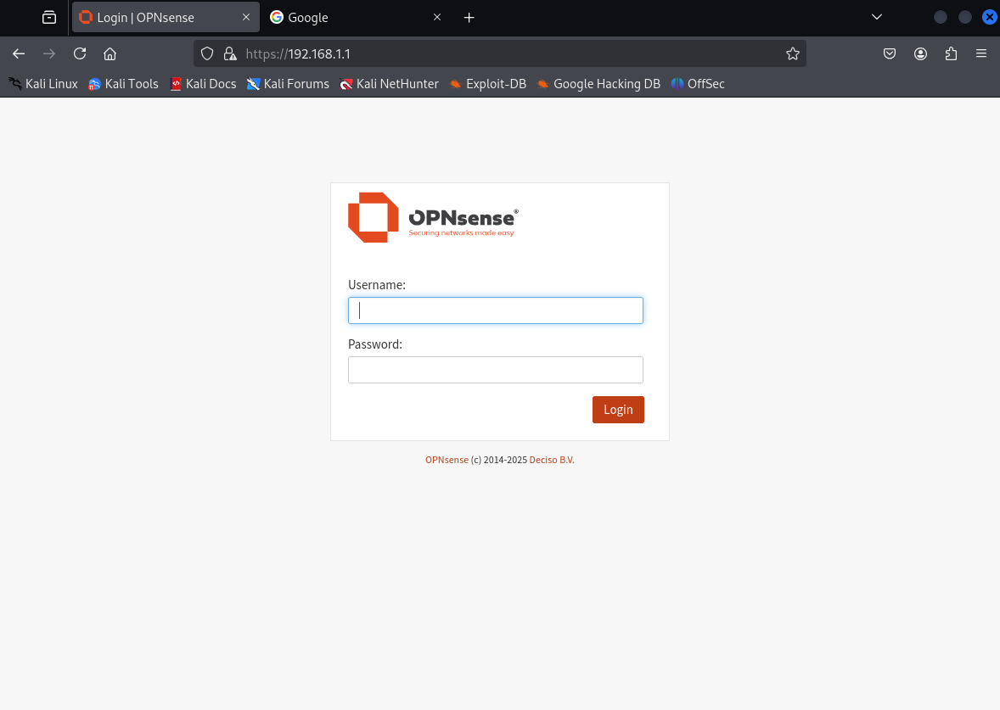
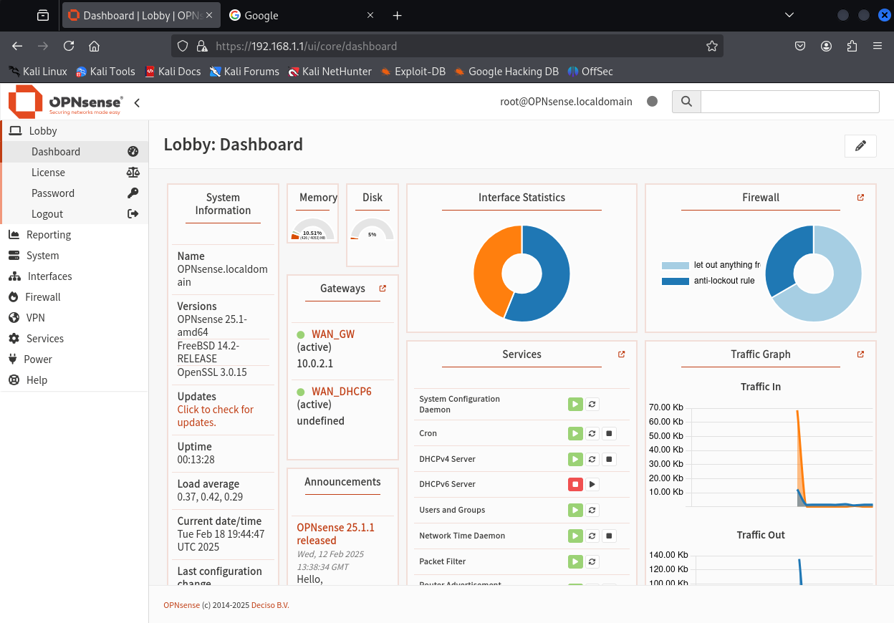
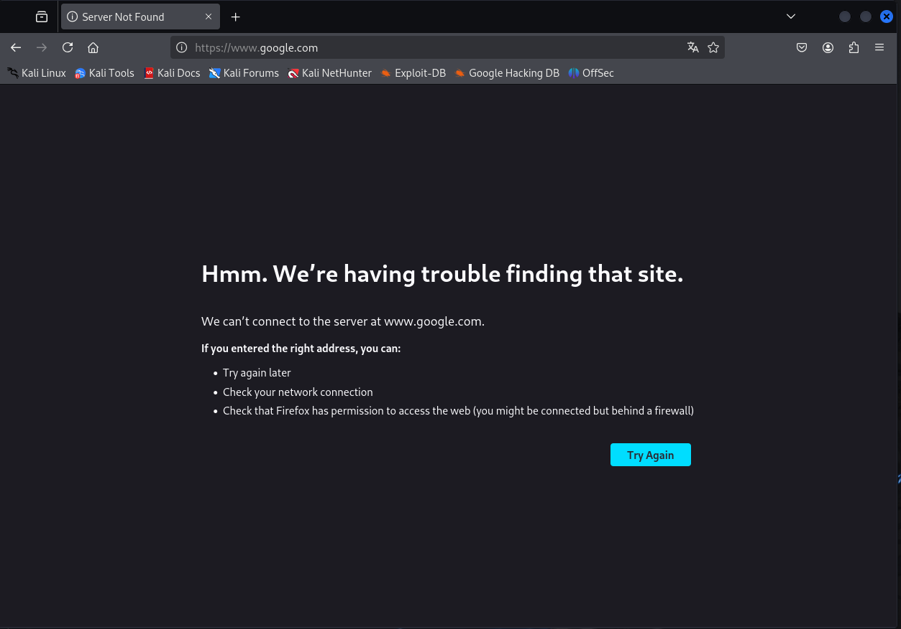

# Øvelse 20 - Opsætning af Opnsense i VirtualBox

Her ses et billede af Opnsense opsætningen i VirtualBox.
Standard login for Opnsense er
- Username: root
- Password: opnsense

Opnsense maskinens netværksindstilling er sat til nat-network.

Jeg har en kali vm, vis netværksindstilling er sat til internal network, hvilket vil sige, at den ikke burde have forbindelse til internettet.

Men som det kan ses, så forbinder vm'en til Opnsenses interface.

Alle ovenstående billeder er taget imens Opnsense vm'en kørte samtidig med kali vm'en. Nedenstående billede er taget, når det kun er kali vm'en, som kører.

