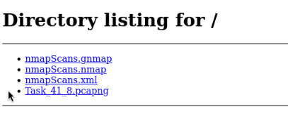

# Øvelse 41 - Nmap wireshark

## Information

Dette er en gruppeøvelse.

I øvelsen [Nmap Basic Port Scans](https://ucl-pba-its.gitlab.io/25f-its-nwsec/exercises/40_thm_nmap/) lærte i NMAP at kende.
Formålet med øvelsen er at lære NMAP lidt bedre at kende og samtidig bruge wireshark til at observere hvordan netværkstrafikken som NMAP laver ser ud.
Øvelsen giver også et indblik i hvordan NMAP kan bruges til at teste sikkerhed i netværksopsætning.

## Instruktioner

1. åbn Kali på proxmox

2. åbn wireshark og vælg eth0 som det interface i sniffer trafik fra

3. åbn en terminal, naviger til Documents mappen og lav en ny mappe som hedder Nmap scans som du kan bruge til at gemme nmap output
kør en nmap scanning i terminalen med kommandoen `nmap -sC -v -oA nmap_scan 192.168.1.1`

4. Hvilken host er det i scanner?

    Det er vores Opnsense, som er vores default gateway

5. Hvilke porte er åbne?

    Port 53, 80 og 443

6. Hvilke protokoller og services kører på de åbne porte?

    DNS, HTTP og HTTPS

7. Hvordan ser trafikken ud i wireshark? (filtrer på den skennede host)

    

8. Gem trafikken fra wireshark som en `.pcapng` fil i `Nmap scans` mappen

9. Åbn endnu en terminal og start en webserver med `sudo python3 -m http.server 8000`

    
    
10. Åbn en browser på adressen `http://127.0.0.1:8000` - hvad ser du?

    Vi kan se filerne i den pågældende folder

11. Kør en nmap scanning i terminalen med kommandoen `nmap -sC -v -oA nmap_scan_webserver 192.168.1.100`

12. Hvilken host er det i scanner?

    Det er kali maskinen

13. Hvilke porte er åbne?

    Port 8000 er åben

14. Hvilke protokoller og services kører på de åbne porte?

    TCP - http-alt service

15. Hvordan ser trafikken ud i wireshark? (filtrer på den skennede host)

    

16. Gem trafikken fra wireshark som en `.pcapng` fil i `Nmap scans` mappen

17. Sluk for webserveren og kør `nmap -sC -v -oA nmap_scan_webserver_2 192.168.1.100`

18. Er der nogle porte som er åbne nu? Hvorfor ikke?

    NEJ. Fordi vi stoppede serveren, hvor vi førhen eksponerede porten