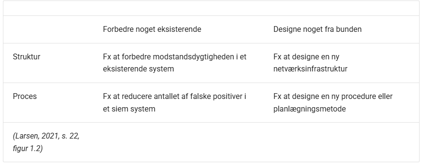

# Øvelse 1 - Problemtyper

[https://www.danskindustri.dk/vi-radgiver-dig/virksomhedsregler-og-varktojer/nis2-vejledningsunivers/hvem-er-omfattet2/](https://www.danskindustri.dk/vi-radgiver-dig/virksomhedsregler-og-varktojer/nis2-vejledningsunivers/hvem-er-omfattet2/)

NIS 2

Fordi NIS 2 er en udvidelse af NIS 1, så omfavner det flere fagområder

Proces - forbedring hvis større virksomhed

Virksomhed skal bygge et SOC - [https://www.mitre.org/news-insights/publication/11-strategies-world-class-cybersecurity-operations-center](https://www.mitre.org/news-insights/publication/11-strategies-world-class-cybersecurity-operations-center)

SOC skal laves fra bunden - ingen lignende struktur i virksomheden