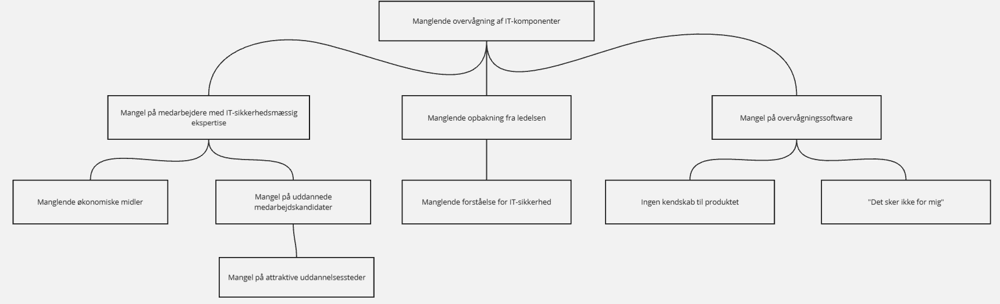

# Øvelse 2 - Problemanalyse

## **1. Hvad er en problemanalyse**

Hvad gør et problem til et problem?

Indsamle/analysere informationer omkring den nuværende situation.

Analysere eventuelle årsagssammenhænge til problemet.

Eventuel inddragelse af empiri på det gældende område.

---

1. **Hvorfor skal der udføres en problemanalyse?**

Mindske scope-creep.

Konkretisering og afklaring af et problem - hvad er egentlig grunden til problemet. Eks. En virksomhed kan opleve mange datalæk, men hvad er kernen af problemet.

Verificering af arbejdet i løbet af et projekt.

---

1. **Hvorfor kommer mange problemstillinger ofte til at pege på løsninger fremfor at identificere problemer?**

Det er “nemmere”, da det ikke er lige så blødt som det at definere et problem.

Det er naturligt at ville løse et problem.  

Specifikt IT er en mandsdomineret branche, måske på grund af den problemløsende natur ved faget. Mange neurodivergente bliver også tiltrukket af faget.

---

1. **Er det realistisk, at en virksomhed på forhånd ved præcist, hvilket IT-sikkerhedsproblem der skal løses, eller skal problemanalysen hjælpe med at afklare dette?**

Ja det nok ret urealistisk.

Problemanalysen skal hjælpe med at afklare dette.

---

1. **Hvordan kan man sikre, at et problem er korrekt verificeret i en problemanalyse?**

Have noget kvalitativt eller kvantitativt data, som skal understøtte begrundelsen for problemet.

---

1. **Hvordan understøtter problemanalysen løsningen af et IT-sikkerhedsprojekt?**

Hvis din problemanalyse er god nok, har du en mere klar idet over, hvad problemet er, og din løsning kan dermed være mere fokuseret (hvilket kan have faglige samt økonomiske gevinster)

---

1. **Hvordan påvirker problemtypen problemanalysen?**

Forbedring - identificere problemet ved det allerede implementerede 

Byg fra bunden - identificere problemet, som din løsning løser 

## **2. Brug af problemtræ som værktøjer i problemanalysen:**

