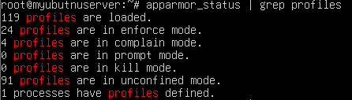

# Opgave 48 - (Gruppeopgave) Ubuntu CIS Benchmarks

## Information

Formålet med denne øvelse er at give en grundlæggende introduktion til CIS Benchmarks.

CIS Benchmark er specifikationer for et specifikt system, hvor der defineres, hvilke krav systemet skal overholde for at være **compliant** med CIS18-kontrollerne. CIS Benchmarks findes til flere forskellige systemer. I øvelsen skal I arbejde med CIS Benchmark for Ubuntu Server, som er et operativsystem. Der findes også benchmarks for andre systemer, f.eks. **Kubernetes**, **Apache HTTP Server**, **Google Chrome**. Opsummerende kan CIS Benchmark beskrives som en slags **konfigurationsguide**, der viser, hvordan et system kan konfigureres ud fra best practices, og hvilken **safeguards** en given CIS18-kontrolkonfiguration understøtter.

Formålet med denne øvelse er, at gruppen skal foretage en vurdering af et Ubuntu-systems overholdelse af udvalgte Ubuntu Server CIS Benchmarks sikkerhedsanbefalinger.

Arbejdet, I skal udføre nu, svarer til at udføre en revision (audit) i forhold til CIS18 compliance af et enkelt system. I skal lave en manuel revision, hvor I foretager vurderingerne ud fra forskrifterne i CIS Benchmarken. I praksis bruger man typisk automatiserede værktøjer til dette, men det ville dog ødelægge øvelsen, da man ved at gennemgå det manuelt får en dybere forståelse af processen. De automatiserede værktøjer bruger kommandoerne på samme måde, som I manuelt skal benytte jer af i øvelsen. Herudover bør det nævnes, at man kan købe OS-images, der er prækonfigureret i henhold til CIS Benchmark-forskrifterne. Disse omtales som [CIS Hardened Images](https://www.cisecurity.org/cis-hardened-image-list).

CIS Benchmarken er ret omfattende, så vælg benchmarks ud fra jeres erfaringsniveau.

## Instruktioner

1. Download CIS Ubuntu Linux-benchmark-dokumentet fra It's Learning (under ressourcer til dagens lektion).
    
    ---
    
2. Skim afsnittet "Overview", og læg mærke til, at alle handlinger skal udføres som root-brugeren (og ikke med sudo-bruger).
    
    ---
    
3. Udvælg en eller flere benchmarks at arbejde med.
    
    ---
    
4. Brug en af gruppens medlemmers Ubuntu-serverinstans til at gennemgå de udvalgte benchmarks fra CIS Benchmarken.
    
    ---
    
5. For hvert punkt i benchmarken skal I undersøge, om systemet overholder anbefalingerne (under punktet "audit").
    
    ---
    
    1.6.1.1 - apparmor is installed
    
    1.6.1.2 - Nothing is returned, that is good
    
    1.6.1.3 - 
    
    
    
    CIS benchmark siger, at profilerne enten skal være i enforce eller complain mode. 
    
    3.5.2.3 - No nftables was present
    
    Vi lavede et nftable til filtrering vha. nft table inet <Name>
    
6. Identificer eventuelle åbenlyse afvigelser fra anbefalingerne.
    
    ---
    
7. Identificer eventuelle foranstaltninger og implementer dem.
    
    ---