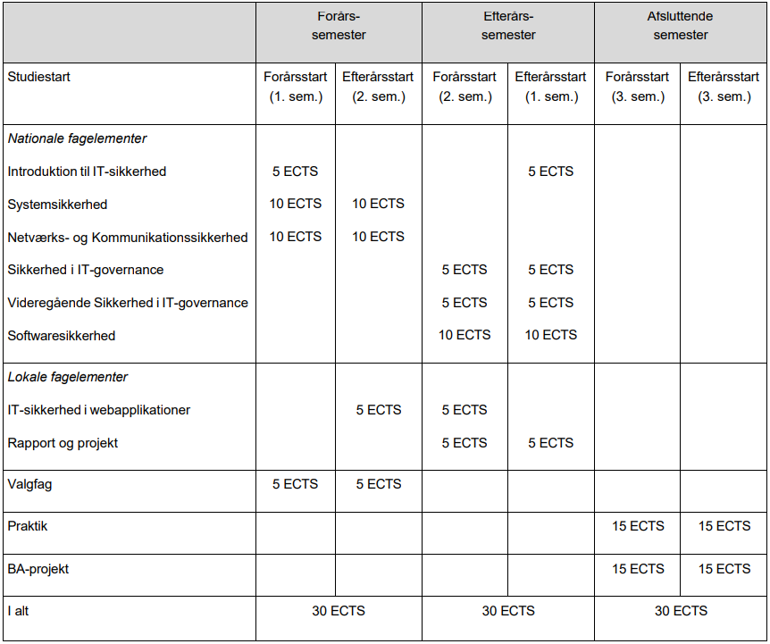

# Øvelse 4

1. Dan dig et overblik over hvad der står i "Studieordning National", hvad indeholder den og hvad står under de forskellige sektioner. Noter de spørgsmål du har til den nationale studieordning.

    Hvorfår står der SQL databaser i den nationale del, og ikke bare relationelle databaser?

    ---

2. Dan dig et overblik over hvad der står i "Studieordning Institutionel del 2022 (først gældende fra 1.feb)", hvad indeholder den og hvad står under de forskellige sektioner. Noter de spørgsmål du har til den Institutionel del af studieordningen.

    

    ---

2. Læs læringsmålene for "Introduktion til IT Sikkerhed" i studieordningen - Noter de spørgsmål du har til læringsmålene.

    ---

3. Læs om "Prøve i Introduktion til IT-sikkerhed", Noter spørgsmål til indholdet.

    ---