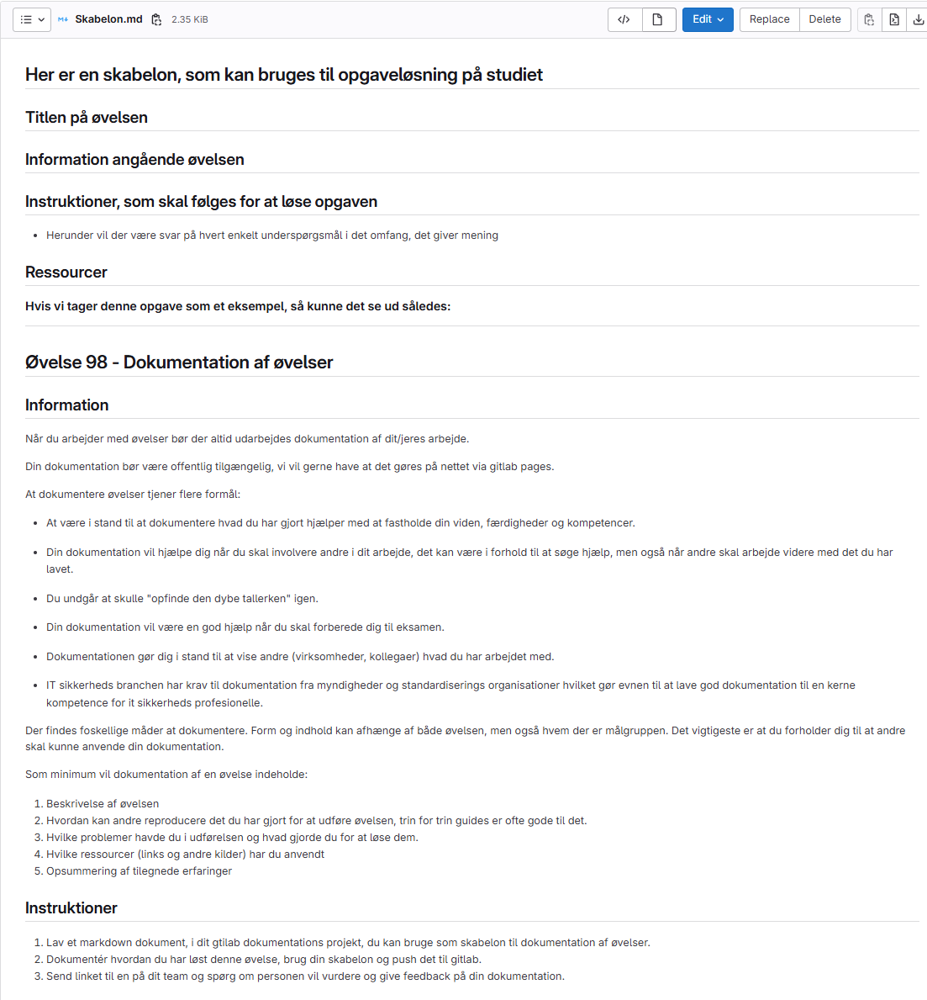
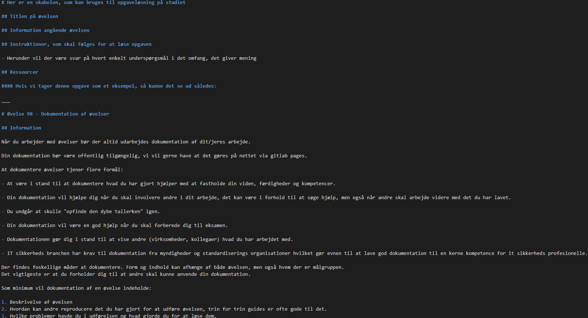
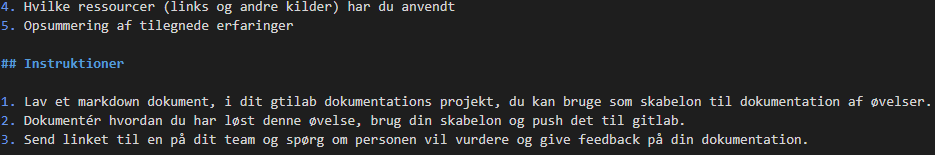
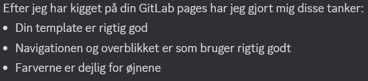

# Her er en skabelon, som kan bruges til opgaveløsning på studiet

## Titlen på øvelsen

## Information angående øvelsen

## Instruktioner, som skal følges for at løse opgaven

- Herunder vil der være svar på hvert enkelt underspørgsmål i det omfang, det giver mening

## Ressourcer

Hvis vi tager udgangspunkt i denne opgave, så kunne en løsning se ud således:

___

# Øvelse 98 - Dokumentation af øvelser

## Information

Når du arbejder med øvelser bør der altid udarbejdes dokumentation af dit/jeres arbejde.

Din dokumentation bør være offentlig tilgængelig, vi vil gerne have at det gøres på nettet via gitlab pages.

At dokumentere øvelser tjener flere formål:

- At være i stand til at dokumentere hvad du har gjort hjælper med at fastholde din viden, færdigheder og kompetencer.

- Din dokumentation vil hjælpe dig når du skal involvere andre i dit arbejde, det kan være i forhold til at søge hjælp, men også når andre skal arbejde videre med det du har lavet.

- Du undgår at skulle "opfinde den dybe tallerken" igen.

- Din dokumentation vil være en god hjælp når du skal forberede dig til eksamen.

- Dokumentationen gør dig i stand til at vise andre (virksomheder, kollegaer) hvad du har arbejdet med.

- IT sikkerheds branchen har krav til dokumentation fra myndigheder og standardiserings organisationer hvilket gør evnen til at lave god dokumentation til en kerne kompetence for it sikkerheds profesionelle.

Der findes foskellige måder at dokumentere. Form og indhold kan afhænge af både øvelsen, men også hvem der er målgruppen.
Det vigtigeste er at du forholder dig til at andre skal kunne anvende din dokumentation.

Som minimum vil dokumentation af en øvelse indeholde:

1. Beskrivelse af øvelsen
2. Hvordan kan andre reproducere det du har gjort for at udføre øvelsen, trin for trin guides er ofte gode til det.
3. Hvilke problemer havde du i udførelsen og hvad gjorde du for at løse dem.
4. Hvilke ressourcer (links og andre kilder) har du anvendt
5. Opsummering af tilegnede erfaringer

## Instruktioner

1. Lav et markdown dokument, i dit gtilab dokumentations projekt, du kan bruge som skabelon til dokumentation af øvelser.
2. Dokumentér hvordan du har løst denne øvelse, brug din skabelon og push det til gitlab.
Det her er billedet af min fil på gitlab:
    
Det her er billederne af min kode i VS Code:
    
    

    (Hvis billederne er svære at se, kan disse ses i Gitlab repositoriet)

3. Send linket til en på dit team og spørg om personen vil vurdere og give feedback på din dokumentation.
    

## Links

[Øvelse 1 - Markdown](https://ucl-pba-its.gitlab.io/25f-its-intro/exercises/1_intro_opgave_markdown/)

[Øvelse 2 - Gitlab og ssh nøgler](https://ucl-pba-its.gitlab.io/25f-its-intro/exercises/2_intro_opgave_git_gitlab_ssh/)

[Øvelse 3 - Gitlab pages](https://ucl-pba-its.gitlab.io/25f-its-intro/exercises/3_intro_opgave_gitlab_pages/)

Herunder er et par eksempler der kan give inspiration til forskellige måder at dokumentere på:

- Trusselsmodelligerings manifestet https://www.threatmodelingmanifesto.org/

- Offensive security red team report https://redteam.guide/docs/Templates/report_template

- Gitlab bug report https://gitlab.com/gitlab-org/gitlab/blob/master/.gitlab/issue_templates/Bug.md