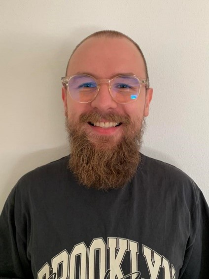

# Velkommen til min Gitlab Pages side!

Her vil jeg dokumentere mit arbejde i løbet af min uddannelsestid, men også efter endt studie
___
# Lidt om mig selv

Mit navn er Mikkel Krüger Larsen. Jeg er 26 år og bor i Odense

Det har aldrig ligget i kortene, at jeg skulle blive uddannet som Datamatiker, og slet ikke at jeg skulle læse videre.
Min far er uddannet mekaniker og arbejder som lastbilchauffør, imens min mor har været salgskoordinater mm.

Inden jeg blev færdig som Datamatiker, har jeg selv en gymnasiel uddannelse. Denne brugte jeg til at søge ind på Syddansk Universitet, hvor jeg læste 2 semestre på Statskundskab. Undervisningsformen på universitetet
var jeg ikke særlig stor fan af, samt den meget forskningsbaserede tilgang til tingene.

Dette gjorde, at jeg droppede ud af universitetet og søgte ind på Datamatikeruddannelsen hos UCL, og hvor var det en god ide, for her fandt jeg min passion. Jeg elsker at lære og dygtiggøre mig, og det kan jeg virkelig få lov til på it-sikkerhed.

## Funktioner på min side

På siderne understøttes både light og dark mode.
Herudover er der også en række tastaturgenveje.

### Kommandoer
- Tastaturgenveje:
    - S: Åbner søgefeltet
    - N: Går til næste side i navigationsbaren
    - P: Går til forrige side i navigationsbaren

